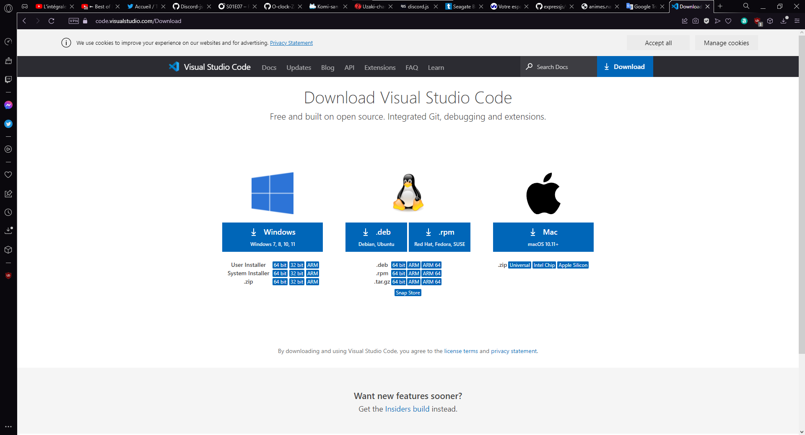
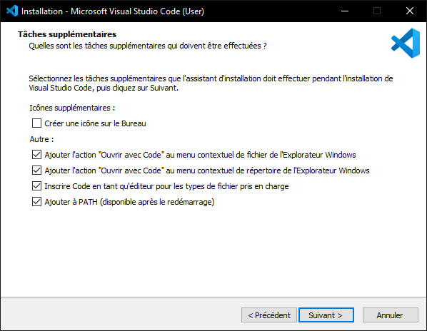
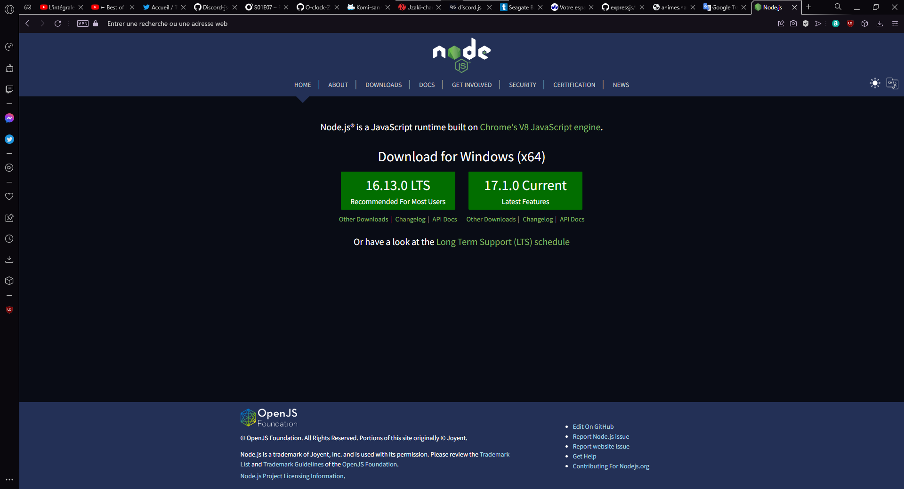

# Les bases de la programmation avec node.js

_Cette série de cours demande un minimum de base en programmation, prenez votre temps_

## Pour commencer, il faut comprendre certaines choses simples :

- Le javascript est un langage de programmation
- **Nodejs** est un moteur permettant d'utiliser le javascript coté serveur. Il permet de récupérer les intérations faites à votre client et à les gérer sur le serveur de l'application, par exemple: si vous voulez supprimer un élément d'un site, votre client (C'est a dire votre application) va demander à son serveur si vous en avez les permissions. C'est donc le serveur qui va se charger de ce genre de chose
- **NPM** (Node package manager) s'utilise en complément de **nodejs**, il permet d'avoir accès aux modules de la communauté (Un module est du code tout fait, ce qui vous facilite la vie)
- Un **IDE** est une interface permettant d'écrire facilement du code, elle dispose d'outils indispensable à la productivité et compréhension

> Au cours de cette petite série de cours, vous pourrez vous aider de [MDN](https://developer.mozilla.org/fr/) qui est la référence du web. Vous pouvez aussi nous contacter sur notre [serveur Discord](https://discord.com/invite/SKqZWWG)

## Commençons par installer nos deux outils principaux :

Nous allons avoir besoins d'un **IDE** et **nodejs** pour poursuivre notre série

### Installation d'un IDE

> L'interface la plus utilisée et celle que je vous recommande, se nomme **Visual Studio Code**. Son installeur est trouvable [ici](https://code.visualstudio.com/Download)

N'oubliez pas de cocher toutes les options

### Installation de Nodejs

> **Nodejs** sera donc notre moteur javascript, voici le lien vers son installeur: https://nodejs.org/en/ (Télécharger et installer la version LTS (stable))

